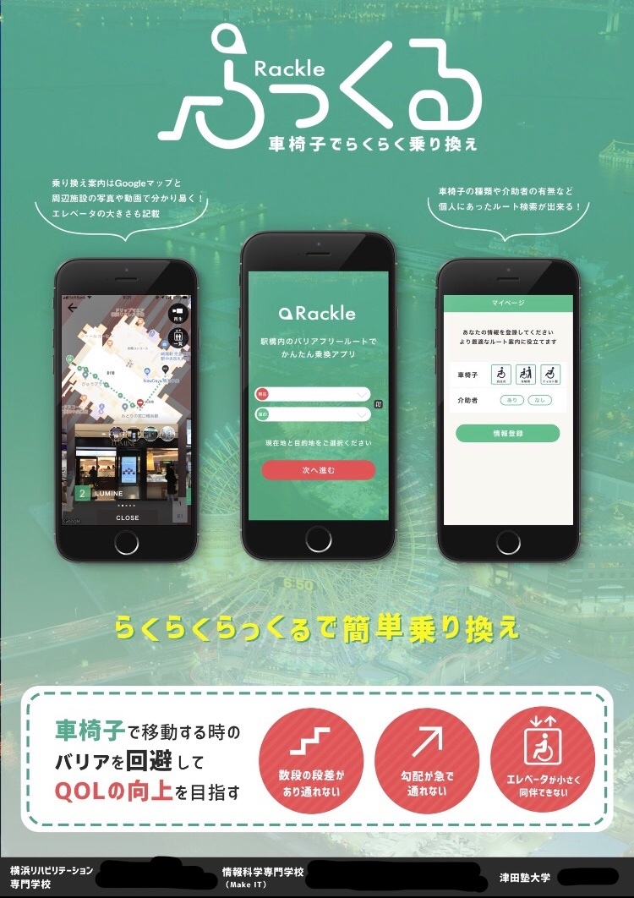

# Wakamono Innovation Network2018 介護ITハッカソン
http://yokohama-youth.jp/win2018/?fbclid=IwAR35pfLZXddKamY7oYW9VAV_QPvhbbnPPhwRt58z21WMivjg0Q1mnNxOC5E

最優秀賞と広報賞を受賞🎉

# 成果物
車椅子、ベビーカー使用者に駅構内の改札から改札のバリアのない経路を案内するアプリです。

# 操作画面

# 技術面
- フロントにReact Nativeを使用
- サーバーサイドはNode.jsを使用
- Google Map Apiの使用

# 今回のアプリに貢献したところ
- 使用するMap Apiの選定
- React Nativeのコーディング

# やってみての感想・今後の課題
- Google Map Api のインドアマップ(地下や屋内1F以外)は初めからインドアマップを表示することができなかった。なので地下や屋内から始まるときは分かりやすいように表示する
- 今回使用するApiの選定を行ったがそれをどこにもまとめていなかったので、次からは選定するときは理由などをまとめておくようにする
